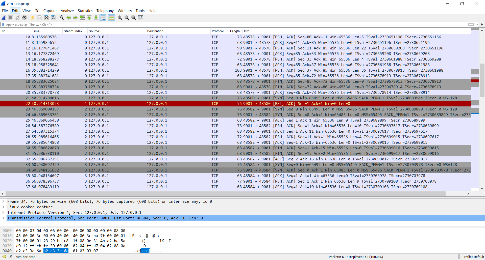
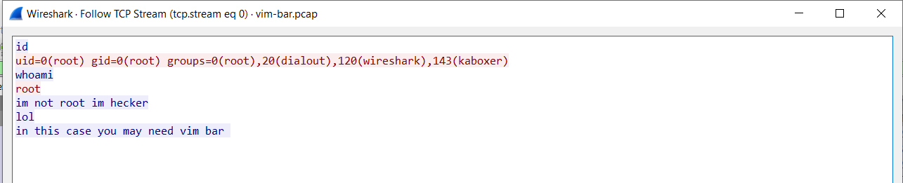
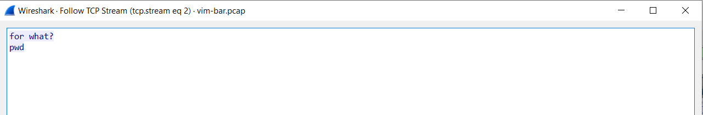
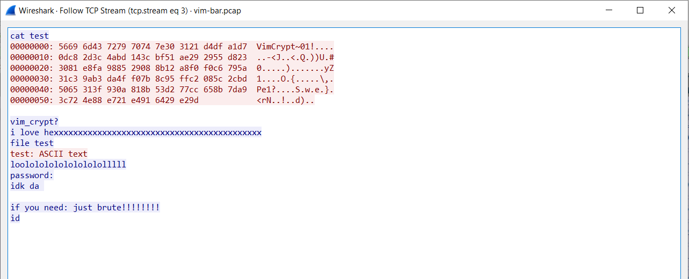
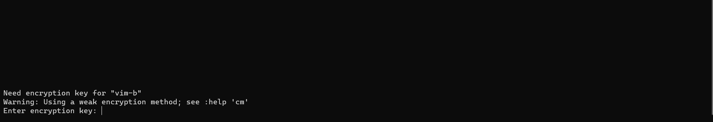
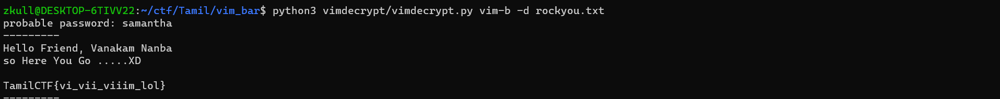

Challenge (Forensic)

It is a straight forward challenge, use your tools wisely

Author - 0xCyberPj

link [download](images/vim-bar.pcap)

-------------------------

Since it's a pcap file, we can use wireshark to explore.

We can see that its just TCP packets. Looking at the stream index, we can see there are 3 different TCP streams.

Following the TCP stream 0, we can see its actually the output of the terminal. But it doesn't help us much.

Moving on to TCP stream 1, we see there are just 2 packets and one of them is RST so we can skip this.

TCP stream 2 also doesn't provide us much info.

TCP stream 3 is where things get interesting. This has the hex dump of a file and the hint vim_crypt tells us that its a file encrypted by vim.

So we create the file locally using the hex dump. But when we open it with vim, we can see its encrypted and is asking for the key

I'm using the python package called [vimdecrypt](https://github.com/nlitsme/vimdecrypt) to bruteforce the password using the rock_you wordlist.

The password used to encrypt was **samantha** and the flag is **TamilCTF{vi_vii_viiim_lol}**